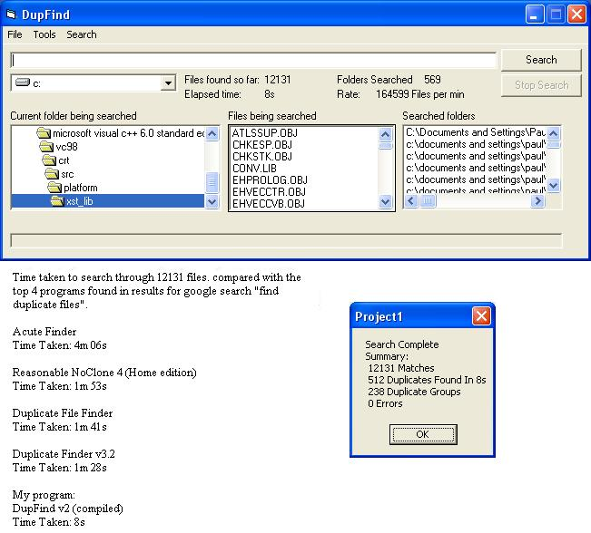



## DupFind v2 The FASTEST duplicate file finding program on the net \(updated 16 apr\)

### Description

Fastest duplicate file finding program on the net (as far as i know) look at the screenshot for comparisons. Features include: Limit search results, only search for specific file types, 100% accurate byte to byte duplicate finding, search multiple folders or drives, disallow certain folders you choose, options to search subdirectories or not. Please take the time to vote and comment. Updated apr 14: Code Much neater and commented, more options. Updated apr 15: Move duplicates and non duplicates, View lists, open containing folder, move single file, copy single file. still not completely tested so there might be a few bugs with the new stuff. Zero Byte error (hopefully) fixed
 
### More Info
 

             |
---                |---
**Submitted On**   |2007-04-15 21:29:28
**By**             |[Paul Morris Hill](https://github.com/Planet-Source-Code/PSCIndex/blob/master/ByAuthor/paul-morris-hill.md)
**Level**          |Intermediate
**User Rating**    |5.0 (45 globes from 9 users)
**Compatibility**  |VB 6\.0
**Category**       |[Files/ File Controls/ Input/ Output](https://github.com/Planet-Source-Code/PSCIndex/blob/master/ByCategory/files-file-controls-input-output__1-3.md)
**World**          |[Visual Basic](https://github.com/Planet-Source-Code/PSCIndex/blob/master/ByWorld/visual-basic.md)
**Archive File**   |[DupFind\_v22060774162007\.zip](https://github.com/Planet-Source-Code/paul-morris-hill-dupfind-v2-the-fastest-duplicate-file-finding-program-on-the-net-updated-__1-68346/archive/master.zip)

